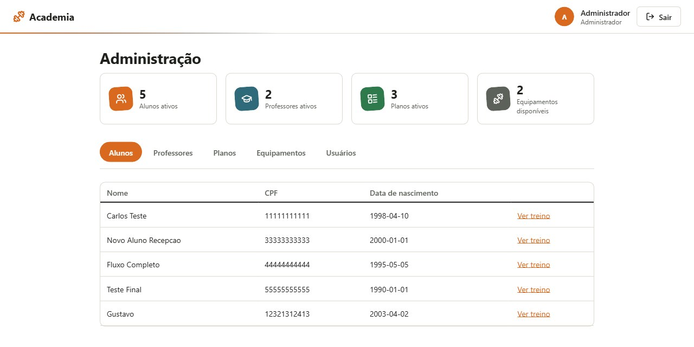
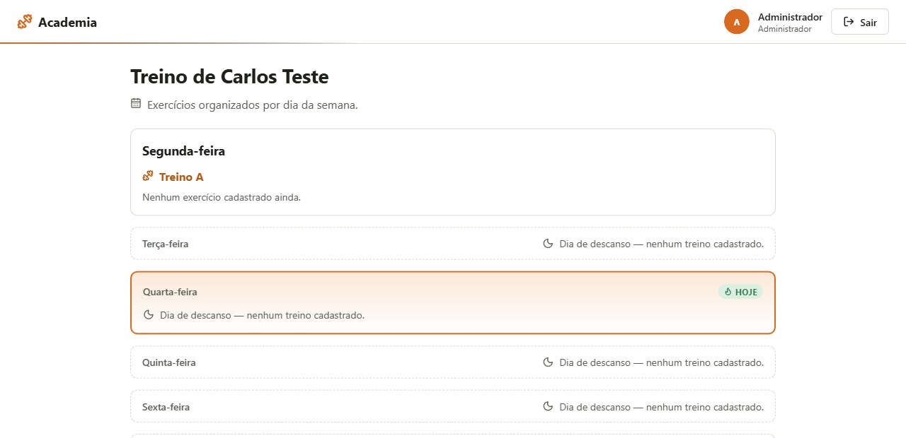
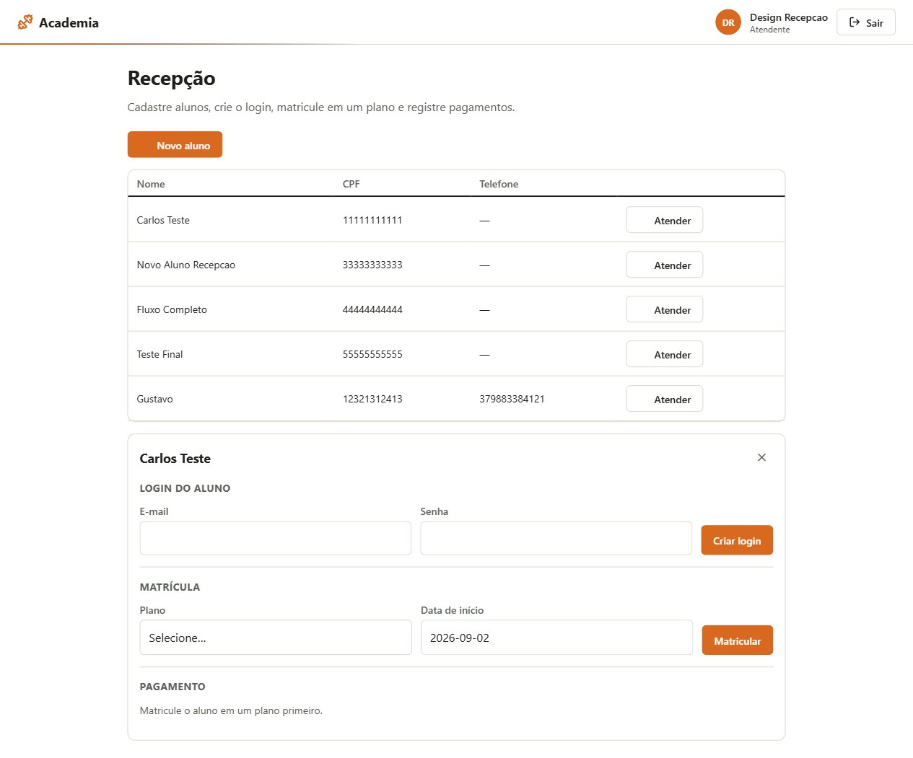

# Academia

Sistema de gestão de academia: cadastro de alunos, professores, planos e
equipamentos, matrícula e cobrança, ficha de treino por dia da semana, e uma
página pública de apresentação. Backend em **Spring Boot**, frontend em
**React**.


## Telas

| | |
|---|---|
|  |  |
| Painel do administrador — visão geral e cadastros | Ficha de treino, organizada por dia da semana |
|  | |
| Recepção — login do aluno, matrícula e pagamento num só painel | |

## Funcionalidades

- **Login com 4 perfis**, cada um enxergando só o que precisa: Administrador,
  Professor, Atendente (recepção) e Aluno.
- **Recepção**: cadastra aluno, cria o login dele, matricula em um plano e
  registra pagamentos — tudo num painel só, sem trocar de tela.
- **Administração**: visão geral (alunos/professores/planos/equipamentos
  ativos) e cadastro de professor, plano e equipamento.
- **Professor**: lista os alunos e monta/consulta a ficha de treino de cada
  um, organizada por dia da semana.
- **Aluno**: acessa o próprio treino da semana.
- **Home pública**: apresentação da academia com os planos vindos direto do
  banco (sem precisar logar para ver preço).

## Stack

| Camada | Tecnologia |
|---|---|
| Backend | Java 21, Spring Boot, Spring Security (JWT), Flyway |
| Frontend | React 19, Vite, React Router |
| Banco | PostgreSQL 16 (com réplica de leitura via streaming replication) |
| Infra local | Docker Compose |

## Como rodar

### 1. Banco de dados

```sh
cp .env.example .env
# edite o .env com suas próprias senhas antes de subir
docker compose up -d
```

Isso sobe o Postgres primário (porta `5432`) e uma réplica somente-leitura
(porta `5433`) — detalhes em [docs/infraestrutura-bd.md](docs/infraestrutura-bd.md).

### 2. Backend

```sh
cd backend
cp src/main/resources/application-local.properties.example src/main/resources/application-local.properties
# preencha usuário, senha do banco e um segredo JWT no arquivo copiado
./gradlew bootRun
```

Na primeira vez que o banco está vazio, um usuário administrador é criado
automaticamente (e-mail/senha configuráveis via `ADMIN_EMAIL`/`ADMIN_PASSWORD`
no `.env`; por padrão `admin@academia.local` / `admin123` — **troque antes de
qualquer ambiente real**).

### 3. Frontend

```sh
cd frontend
npm install
npm run dev
```

Acesse `http://localhost:5173`.

## Estrutura do projeto

```
backend/    API REST (Spring Boot) — controllers, services, entidades, migrations Flyway
frontend/   SPA em React (Vite)
docs/       Documentação de apoio (requisitos, infraestrutura do banco)
```

## Modelo de dados

`aluno`, `professor`, `equipamento`, `plano`, `usuario` (login), `matricula`
(vínculo aluno–plano), `pagamento` e `treino`/`treino_exercicio` (ficha de
treino por dia da semana). Detalhes do levantamento original em
[docs/requisitos.md](docs/requisitos.md).
